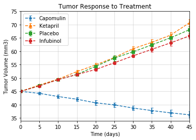
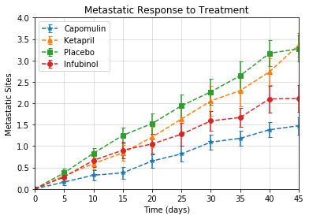
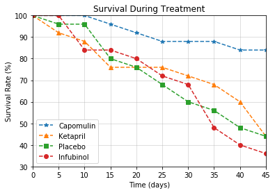
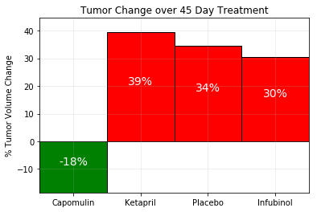

## Option 2: Pymaceuticals Inc


While your data companions rushed off to jobs in finance and government, you remained adamant that science was the way for you. Staying true to your mission, you've since joined Pymaceuticals Inc., a burgeoning pharmaceutical company based out of San Diego, CA. Pymaceuticals specializes in drug-based, anti-cancer pharmaceuticals. In their most recent efforts, they've since begun screening for potential treatments to squamous cell carcinoma (SCC), a commonly occurring form of skin cancer.

As their Chief Data Analyst, you've been given access to the complete data from their most recent animal study. In this study, 250 mice were treated through a variety of drug regimes over the course of 45 days. Their physiological responses were then monitored over the course of that time. Your objective is to analyze the data to show how four treatments (Capomulin, Infubinol, Ketapril, and Placebo) compare.

To do this you are tasked with:

* Creating a scatter plot that shows how the tumor volume changes over time for each treatment.
* Creating a scatter plot that shows how the number of [metastatic](https://en.wikipedia.org/wiki/Metastasis) (cancer spreading) sites changes over time for each treatment.
* Creating a scatter plot that shows the number of mice still alive through the course of treatment (Survival Rate)
* Creating a bar graph that compares the total % tumor volume change for each drug across the full 45 days.

As final considerations:

* You must use the Pandas Library and the Jupyter Notebook.
* You must use the Matplotlib and Seaborn libraries.
* You must include a written description of three observable trends based on the data.
* You must use proper labeling of your plots, including aspects like: Plot Titles, Axes Labels, Legend Labels, X and Y Axis Limits, etc.
* Your scatter plots must include [error bars](https://en.wikipedia.org/wiki/Error_bar). This will allow the company to account for variability between mice. You may want to look into [`pandas.DataFrame.sem`](http://pandas.pydata.org/pandas-docs/stable/generated/pandas.DataFrame.sem.html) for ideas on how to calculate this.
* Remember when making your plots to consider aesthetics!
  * Your legends should not be overlaid on top of any data.
  * Your bar graph should indicate tumor growth as red and tumor reduction as green.
    It should also include a label with the percentage change for each bar. You may want to consult this [tutorial](http://composition.al/blog/2015/11/29/a-better-way-to-add-labels-to-bar-charts-with-matplotlib/) for relevant code snippets.
* You must include an exported markdown version of your Notebook called  `README.md` in your GitHub repository.
* See [Example Solution](Pymaceuticals/Pymaceuticals_Example.pdf) for a reference on expected format. (Note: For this example, you are not required to match the tables or data frames included. Your only goal is to build the scatter plots and bar graphs. Consider the tables to be potential clues, but feel free to approach this problem, however, you like.)


```python
## Three Observable Trends 
#1. Capomulin was legitimately successful at treating the tumors in this population of mice. 
#2. Some of the other treatments were arguably less effective than a placebo. 
#3. Infubinol was potentially more effecive than the placebo and warrants some further investigation and alteration.
```


```python
# Import dependencies
import pandas as pd
import matplotlib.pyplot as plt
from scipy import stats
import numpy as np
```


```python
# Read in the clinical trials data into data frames
csv_path = 'raw_data/clinicaltrial_data-Copy1.csv'

ct_df = pd.read_csv(csv_path)

ct_df.head()
```


<div>
<style scoped>
    .dataframe tbody tr th:only-of-type {
        vertical-align: middle;
    }

    .dataframe tbody tr th {
        vertical-align: top;
    }

    .dataframe thead th {
        text-align: right;
    }
</style>
<table border="1" class="dataframe">
  <thead>
    <tr style="text-align: right;">
      <th></th>
      <th>Mouse ID</th>
      <th>Timepoint</th>
      <th>Tumor Volume (mm3)</th>
      <th>Metastatic Sites</th>
    </tr>
  </thead>
  <tbody>
    <tr>
      <th>0</th>
      <td>b128</td>
      <td>0</td>
      <td>45.0</td>
      <td>0</td>
    </tr>
    <tr>
      <th>1</th>
      <td>f932</td>
      <td>0</td>
      <td>45.0</td>
      <td>0</td>
    </tr>
    <tr>
      <th>2</th>
      <td>g107</td>
      <td>0</td>
      <td>45.0</td>
      <td>0</td>
    </tr>
    <tr>
      <th>3</th>
      <td>a457</td>
      <td>0</td>
      <td>45.0</td>
      <td>0</td>
    </tr>
    <tr>
      <th>4</th>
      <td>c819</td>
      <td>0</td>
      <td>45.0</td>
      <td>0</td>
    </tr>
  </tbody>
</table>
</div>


```python
# Read in the clinical trials data into data frames
csv_path = 'raw_data/mouse_drug_data-Copy1.csv'

mouse_df = pd.read_csv(csv_path)

mouse_df.head()
```


<div>
<style scoped>
    .dataframe tbody tr th:only-of-type {
        vertical-align: middle;
    }

    .dataframe tbody tr th {
        vertical-align: top;
    }

    .dataframe thead th {
        text-align: right;
    }
</style>
<table border="1" class="dataframe">
  <thead>
    <tr style="text-align: right;">
      <th></th>
      <th>Mouse ID</th>
      <th>Drug</th>
    </tr>
  </thead>
  <tbody>
    <tr>
      <th>0</th>
      <td>f234</td>
      <td>Stelasyn</td>
    </tr>
    <tr>
      <th>1</th>
      <td>x402</td>
      <td>Stelasyn</td>
    </tr>
    <tr>
      <th>2</th>
      <td>a492</td>
      <td>Stelasyn</td>
    </tr>
    <tr>
      <th>3</th>
      <td>w540</td>
      <td>Stelasyn</td>
    </tr>
    <tr>
      <th>4</th>
      <td>v764</td>
      <td>Stelasyn</td>
    </tr>
  </tbody>
</table>
</div>


```python
# In order to analyze the data by treatment, we need to merge the data
merged_data = pd.merge(ct_df, mouse_df, on="Mouse ID", how="inner")

merged_data.head()
```


<div>
<style scoped>
    .dataframe tbody tr th:only-of-type {
        vertical-align: middle;
    }

    .dataframe tbody tr th {
        vertical-align: top;
    }

    .dataframe thead th {
        text-align: right;
    }
</style>
<table border="1" class="dataframe">
  <thead>
    <tr style="text-align: right;">
      <th></th>
      <th>Mouse ID</th>
      <th>Timepoint</th>
      <th>Tumor Volume (mm3)</th>
      <th>Metastatic Sites</th>
      <th>Drug</th>
    </tr>
  </thead>
  <tbody>
    <tr>
      <th>0</th>
      <td>b128</td>
      <td>0</td>
      <td>45.000000</td>
      <td>0</td>
      <td>Capomulin</td>
    </tr>
    <tr>
      <th>1</th>
      <td>b128</td>
      <td>5</td>
      <td>45.651331</td>
      <td>0</td>
      <td>Capomulin</td>
    </tr>
    <tr>
      <th>2</th>
      <td>b128</td>
      <td>10</td>
      <td>43.270852</td>
      <td>0</td>
      <td>Capomulin</td>
    </tr>
    <tr>
      <th>3</th>
      <td>b128</td>
      <td>15</td>
      <td>43.784893</td>
      <td>0</td>
      <td>Capomulin</td>
    </tr>
    <tr>
      <th>4</th>
      <td>b128</td>
      <td>20</td>
      <td>42.731552</td>
      <td>0</td>
      <td>Capomulin</td>
    </tr>
  </tbody>
</table>
</div>


```python
## Tumor Response to Treatment

# Subset the data to the Tumor Volume and compute the means, grouped by Drug and Timepoint
subset_df = merged_data.loc[:,["Timepoint", "Drug", "Tumor Volume (mm3)"]]

means = subset_df.groupby(["Drug", "Timepoint"]).mean()

means.head()
```


<div>
<style scoped>
    .dataframe tbody tr th:only-of-type {
        vertical-align: middle;
    }

    .dataframe tbody tr th {
        vertical-align: top;
    }

    .dataframe thead th {
        text-align: right;
    }
</style>
<table border="1" class="dataframe">
  <thead>
    <tr style="text-align: right;">
      <th></th>
      <th></th>
      <th>Tumor Volume (mm3)</th>
    </tr>
    <tr>
      <th>Drug</th>
      <th>Timepoint</th>
      <th></th>
    </tr>
  </thead>
  <tbody>
    <tr>
      <th rowspan="5" valign="top">Capomulin</th>
      <th>0</th>
      <td>45.000000</td>
    </tr>
    <tr>
      <th>5</th>
      <td>44.266086</td>
    </tr>
    <tr>
      <th>10</th>
      <td>43.084291</td>
    </tr>
    <tr>
      <th>15</th>
      <td>42.064317</td>
    </tr>
    <tr>
      <th>20</th>
      <td>40.716325</td>
    </tr>
  </tbody>
</table>
</div>


```python
# Take the standard error of the grouped data frame
sems = subset_df.groupby(["Drug", "Timepoint"]).sem()

sems.head()
```


<div>
<style scoped>
    .dataframe tbody tr th:only-of-type {
        vertical-align: middle;
    }

    .dataframe tbody tr th {
        vertical-align: top;
    }

    .dataframe thead th {
        text-align: right;
    }
</style>
<table border="1" class="dataframe">
  <thead>
    <tr style="text-align: right;">
      <th></th>
      <th></th>
      <th>Tumor Volume (mm3)</th>
    </tr>
    <tr>
      <th>Drug</th>
      <th>Timepoint</th>
      <th></th>
    </tr>
  </thead>
  <tbody>
    <tr>
      <th rowspan="5" valign="top">Capomulin</th>
      <th>0</th>
      <td>0.000000</td>
    </tr>
    <tr>
      <th>5</th>
      <td>0.448593</td>
    </tr>
    <tr>
      <th>10</th>
      <td>0.702684</td>
    </tr>
    <tr>
      <th>15</th>
      <td>0.838617</td>
    </tr>
    <tr>
      <th>20</th>
      <td>0.909731</td>
    </tr>
  </tbody>
</table>
</div>


```python
# This scatter plot shows how the tumor volume changes over time for each treatment.
plt.errorbar(np.arange(0, 50, 5), means.loc["Capomulin", "Tumor Volume (mm3)"],
             yerr = sems.loc["Capomulin", "Tumor Volume (mm3)"], fmt = '*--', capsize = 2.5, label = "Capomulin")
plt.errorbar(np.arange(0, 50, 5), means.loc["Ketapril", "Tumor Volume (mm3)"],
             yerr = sems.loc["Ketapril", "Tumor Volume (mm3)"], fmt = '^--', capsize = 2.5, label = "Ketapril")
plt.errorbar(np.arange(0, 50, 5), means.loc["Placebo", "Tumor Volume (mm3)"],
             yerr = sems.loc["Placebo", "Tumor Volume (mm3)"], fmt = 's--', capsize = 2.5, label = "Placebo")
plt.errorbar(np.arange(0, 50, 5), means.loc["Infubinol", "Tumor Volume (mm3)"],
             yerr = sems.loc["Infubinol", "Tumor Volume (mm3)"], fmt = 'o--', capsize = 2.5, label = "Infubinol")

# Add legend
plt.legend(loc="best")

# Add gridlines
plt.grid(alpha = 0.5)

# Add labels
plt.title('Tumor Response to Treatment')
plt.xlabel('Time (days)')
plt.ylabel('Tumor Volume (mm3)')

# Add x limits and y limits
plt.xlim(0,45)
plt.ylim(34,75)

# Plot the graph
plt.show()
```





```python
## Metastatic Response to Treatment

# Subset the data to the Metastatic Sites and compute the means, grouped by Drug and Timepoint
subset_df = merged_data.loc[:,["Timepoint", "Drug", "Metastatic Sites"]]

means = subset_df.groupby(["Drug", "Timepoint"]).mean()

means.head()
```


<div>
<style scoped>
    .dataframe tbody tr th:only-of-type {
        vertical-align: middle;
    }

    .dataframe tbody tr th {
        vertical-align: top;
    }

    .dataframe thead th {
        text-align: right;
    }
</style>
<table border="1" class="dataframe">
  <thead>
    <tr style="text-align: right;">
      <th></th>
      <th></th>
      <th>Metastatic Sites</th>
    </tr>
    <tr>
      <th>Drug</th>
      <th>Timepoint</th>
      <th></th>
    </tr>
  </thead>
  <tbody>
    <tr>
      <th rowspan="5" valign="top">Capomulin</th>
      <th>0</th>
      <td>0.000000</td>
    </tr>
    <tr>
      <th>5</th>
      <td>0.160000</td>
    </tr>
    <tr>
      <th>10</th>
      <td>0.320000</td>
    </tr>
    <tr>
      <th>15</th>
      <td>0.375000</td>
    </tr>
    <tr>
      <th>20</th>
      <td>0.652174</td>
    </tr>
  </tbody>
</table>
</div>


```python
# Take the standard error of the grouped data frame
sems = subset_df.groupby(["Drug", "Timepoint"]).sem()

sems.head()
```


<div>
<style scoped>
    .dataframe tbody tr th:only-of-type {
        vertical-align: middle;
    }

    .dataframe tbody tr th {
        vertical-align: top;
    }

    .dataframe thead th {
        text-align: right;
    }
</style>
<table border="1" class="dataframe">
  <thead>
    <tr style="text-align: right;">
      <th></th>
      <th></th>
      <th>Metastatic Sites</th>
    </tr>
    <tr>
      <th>Drug</th>
      <th>Timepoint</th>
      <th></th>
    </tr>
  </thead>
  <tbody>
    <tr>
      <th rowspan="5" valign="top">Capomulin</th>
      <th>0</th>
      <td>0.000000</td>
    </tr>
    <tr>
      <th>5</th>
      <td>0.074833</td>
    </tr>
    <tr>
      <th>10</th>
      <td>0.125433</td>
    </tr>
    <tr>
      <th>15</th>
      <td>0.132048</td>
    </tr>
    <tr>
      <th>20</th>
      <td>0.161621</td>
    </tr>
  </tbody>
</table>
</div>


```python
# This scatter plot shows how the tumor volume changes over time for each treatment.
plt.errorbar(np.arange(0, 50, 5), means.loc["Capomulin", "Metastatic Sites"],
             yerr = sems.loc["Capomulin", "Metastatic Sites"], fmt = '*--', capsize = 2.5, label = "Capomulin")
plt.errorbar(np.arange(0, 50, 5), means.loc["Ketapril", "Metastatic Sites"],
             yerr = sems.loc["Ketapril", "Metastatic Sites"], fmt = '^--', capsize = 2.5, label = "Ketapril")
plt.errorbar(np.arange(0, 50, 5), means.loc["Placebo", "Metastatic Sites"],
             yerr = sems.loc["Placebo", "Metastatic Sites"], fmt = 's--', capsize = 2.5, label = "Placebo")
plt.errorbar(np.arange(0, 50, 5), means.loc["Infubinol", "Metastatic Sites"],
             yerr = sems.loc["Infubinol", "Metastatic Sites"], fmt = 'o--', capsize = 2.5, label = "Infubinol")

# Add legend
plt.legend(loc="best")

# Add gridlines
plt.grid(alpha = 0.5)

# Add labels
plt.title('Metastatic Response to Treatment')
plt.xlabel('Time (days)')
plt.ylabel('Metastatic Sites')

# Add x limits and y limits
plt.xlim(0,45)
plt.ylim(0,4)

# Plot the graph
plt.show()
```





```python
## Survival Rate

# Subset the data to be grouped by Drug and Timepoint and take a count of Mouse ID to find overal survival
grouped_df = merged_data.groupby(["Drug", "Timepoint"])

subset_df = grouped_df[["Mouse ID"]].count().rename(columns={"Mouse ID": "Mouse Count"})

subset_df.head()
```


<div>
<style scoped>
    .dataframe tbody tr th:only-of-type {
        vertical-align: middle;
    }

    .dataframe tbody tr th {
        vertical-align: top;
    }

    .dataframe thead th {
        text-align: right;
    }
</style>
<table border="1" class="dataframe">
  <thead>
    <tr style="text-align: right;">
      <th></th>
      <th></th>
      <th>Mouse Count</th>
    </tr>
    <tr>
      <th>Drug</th>
      <th>Timepoint</th>
      <th></th>
    </tr>
  </thead>
  <tbody>
    <tr>
      <th rowspan="5" valign="top">Capomulin</th>
      <th>0</th>
      <td>25</td>
    </tr>
    <tr>
      <th>5</th>
      <td>25</td>
    </tr>
    <tr>
      <th>10</th>
      <td>25</td>
    </tr>
    <tr>
      <th>15</th>
      <td>24</td>
    </tr>
    <tr>
      <th>20</th>
      <td>23</td>
    </tr>
  </tbody>
</table>
</div>


```python
# This scatter plot shows how the survival rate changes over time for each treatment.
# Note that we multiply by 100 and divide by 25 (aka multiply by 4) in order to get a percentage
plt.plot(np.arange(0, 50, 5), 100*subset_df.loc["Capomulin", "Mouse Count"]/25,
         marker = '*', label = "Capomulin", linestyle ='--')
plt.plot(np.arange(0, 50, 5), 100*subset_df.loc["Ketapril", "Mouse Count"]/25,
         marker = '^', label = "Ketapril", linestyle = '--')
plt.plot(np.arange(0, 50, 5), 100*subset_df.loc["Placebo", "Mouse Count"]/25,
         marker = 's', label = "Placebo", linestyle ='--')
plt.plot(np.arange(0, 50, 5), 100*subset_df.loc["Infubinol", "Mouse Count"]/25,
         marker = 'o', label = "Infubinol", linestyle ='--')

# Add legend
plt.legend(loc="best")

# Add gridlines
plt.grid(alpha = 0.5)

# Add labels
plt.title('Survival During Treatment')
plt.xlabel('Time (days)')
plt.ylabel('Survival Rate (%)')

# Add x limits and y limits
plt.xlim(0,45)
plt.ylim(30,100)

# Plot the graph
plt.show()
```





```python
## Summary Bar Graph 

# Compute the initial volume of the tumors by drug by summing all values at timepoint 0.
initial_volumes = merged_data.loc[(merged_data["Timepoint"] == 0), ["Drug", "Tumor Volume (mm3)"]]
init_vol = initial_volumes.groupby("Drug")["Tumor Volume (mm3)"].sum()

# Initialize a tracking data frame. Then loop through each mouse to find their final tumor volume and record it.
end_vol = pd.DataFrame(columns = ['Drug', 'Tumor Volume (mm3)'])

for mouse in mouse_df["Mouse ID"]:
    max_time = merged_data.loc[merged_data["Mouse ID"] == mouse, "Timepoint"].max()
    vol_final = merged_data.loc[(merged_data["Timepoint"] == max_time) & (merged_data["Mouse ID"] == mouse),
                                ["Drug", "Tumor Volume (mm3)"]]    
    end_vol = pd.concat([end_vol, vol_final])

# Group the final volumes by drug so we can compare it to the initial volume
end_grouped = end_vol.groupby("Drug")["Tumor Volume (mm3)"].sum()

# Subtract the initial volume from the final volume and divide by the initial volume to get the % difference
vol_change = 100*(end_grouped - init_vol)/init_vol

print(vol_change)
```

    Drug
    Capomulin   -18.516516
    Ceftamin     28.342171
    Infubinol    30.442222
    Ketapril     39.569314
    Naftisol     36.012793
    Placebo      34.463143
    Propriva     26.580767
    Ramicane    -19.574688
    Stelasyn     35.827583
    Zoniferol    31.513906
    Name: Tumor Volume (mm3), dtype: float64
    


```python
# Referencing http://composition.al/blog/2015/11/29/a-better-way-to-add-labels-to-bar-charts-with-matplotlib/
# This funciton labels each bar (rectangle object) with its height value
def autolabel(rects, ax):
    # Get y-axis height to calculate label position from.
    (y_bottom, y_top) = ax.get_ylim()
    y_height = y_top - y_bottom

    for rect in rects:
        height = rect.get_height()
        
        # Just print the percentage in the center of the bar
        label_position = height/2

        ax.text(rect.get_x() + rect.get_width()/2., label_position,str('%d' % int(height)) + '%',
                ha='center', va='bottom', color = 'w', size = 14)
```


```python
# Plot the bar chart for percent change
fig, ax = plt.subplots()

x_axis = np.arange(0,4,1)
heights = [vol_change["Capomulin"], vol_change["Ketapril"], vol_change["Placebo"], vol_change["Infubinol"]]
labels = ["Capomulin", "Ketapril", "Placebo", "Infubinol"]
colors = []

# If the change in volume is positive, assign the color red, else green
for vols in heights:
    if vols >= 0:
        colors.append('r')
    else:
        colors.append('g')

barplot = ax.bar(x_axis, heights, width = 1, align='center', color = colors,
                 edgecolor = 'black', linewidth = 1, tick_label = labels)

# Add labeling
ax.set_title("Tumor Change over 45 Day Treatment")
ax.set_ylabel("% Tumor Volume Change")

# Add Gridlines
ax.grid(alpha = 0.25)

# Adjust axis
ax.set_xlim(-.5,3.5)
ax.set_ylim(min(heights), max(heights)+5)

# Add labels for the percentages
autolabel(barplot, ax)

plt.show()
```




